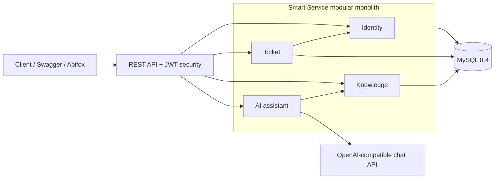

# Smart Service

[English](README.md) | [简体中文](README.zh-CN.md)

[](https://github.com/walnut25/ServiceMind/actions/workflows/ci.yml)
[](https://openjdk.org/projects/jdk/21/)
[](https://spring.io/projects/spring-boot)

An AI-assisted enterprise support platform that connects ticket workflows, operational knowledge, and
grounded answers in one modular Spring Boot application.

Smart Service is intentionally built as a modular monolith: business boundaries stay explicit while
deployment and local development remain simple. The current release is a complete backend MVP with
authentication, requester isolation, ticket assignment, audit history, knowledge publishing, and
provider-neutral RAG answers.

## Engineering highlights

| Area | What is implemented |
| --- | --- |
| Secure workflows | Stateless JWT authentication, BCrypt credentials, administrator-managed users, RBAC, and requester-scoped ticket access |
| Ticket operations | Priority, assignment, filtering, pagination, controlled state transitions, comments, and immutable audit events |
| Knowledge lifecycle | Draft, publish, archive, optimistic locking, visibility rules, and MySQL full-text search |
| Grounded AI | Published-article retrieval, prompt-injection boundaries, configurable OpenAI-compatible provider, and cited sources |
| Reliability | Flyway migrations, RFC 9457 problem responses, health/metrics endpoints, Docker health checks, and non-root containers |
| Verification | Unit, domain, MockMvc security, and MySQL 8.4 Testcontainers tests executed by GitHub Actions |

## Architecture



The modules communicate through application services and repository abstractions rather than sharing
controller logic. See [the architecture guide](docs/architecture.md) for the ER model, security flow,
ticket state machine, RAG sequence, and design trade-offs.

## Modules

| Module | Responsibility | Main capabilities |
| --- | --- | --- |
| `identity` | Authentication and authorization | User administration, BCrypt, JWT issuance, roles, admin bootstrap |
| `ticket` | Support request workflow | Ownership, assignment, status transitions, comments, audit trail |
| `knowledge` | Operational knowledge | Article lifecycle, visibility rules, pagination, full-text search |
| `ai` | Grounded support answers | Knowledge retrieval, context limits, provider gateway, citations |
| `common` | Cross-cutting HTTP concerns | Problem Details, OpenAPI metadata, stable page serialization |

## Technology stack

- Java 21 and Spring Boot 3.5
- Spring Web, Validation, Data JPA, Security, OAuth2 Resource Server, and Actuator
- MySQL 8.4 with Flyway migrations and full-text indexes
- Springdoc OpenAPI and Swagger UI
- JUnit 5, Mockito, MockMvc, AssertJ, and Testcontainers
- Docker multi-stage builds and Docker Compose
- GitHub Actions continuous integration

## Run locally

The quickest path only requires Docker:

```bash
docker compose up --build
```

This builds the application image, starts MySQL, applies Flyway migrations, and waits for both services
to become healthy. Copy `.env.example` to `.env` to customize ports, credentials, or the AI provider.
The checked-in defaults are for local development only.

If port `3306` is already occupied, set another host port in `.env`:

```text
MYSQL_PORT=3307
```

For development with the application running directly on the host, use JDK 21:

```bash
docker compose up -d mysql
./mvnw spring-boot:run
```

The default local administrator is `admin` / `Admin123!`. Use a strong `JWT_SECRET`, administrator
password, and database credentials in every non-local environment.

## Five-minute API demo

Log in and copy the returned `accessToken`:

```bash
curl -X POST http://localhost:8081/api/v1/auth/login \
  -H "Content-Type: application/json" \
  -d '{"username":"admin","password":"Admin123!"}'
```

Create an agent account:

```bash
curl -X POST http://localhost:8081/api/v1/users \
  -H "Content-Type: application/json" \
  -H "Authorization: Bearer <access-token>" \
  -d '{"username":"agent-one","password":"AgentPass123!","roles":["AGENT"]}'
```

Create a ticket:

```bash
curl -X POST http://localhost:8081/api/v1/tickets \
  -H "Content-Type: application/json" \
  -H "Authorization: Bearer <access-token>" \
  -d '{"title":"VPN unavailable","description":"The whole team cannot connect","priority":"P1"}'
```

Assign it and begin work:

```bash
curl -X PATCH http://localhost:8081/api/v1/tickets/1/assignee \
  -H "Content-Type: application/json" \
  -H "Authorization: Bearer <access-token>" \
  -d '{"username":"agent-one"}'

curl -X PATCH http://localhost:8081/api/v1/tickets/1/status \
  -H "Content-Type: application/json" \
  -H "Authorization: Bearer <access-token>" \
  -d '{"status":"IN_PROGRESS"}'
```

## API overview

| Area | Endpoints | Access |
| --- | --- | --- |
| Authentication | `POST /api/v1/auth/login` | Public |
| Users | Create, get, list, enable, disable | Administrator |
| Tickets | Create, get, list/filter, assign, transition | Authenticated; assignment/transition require agent or admin |
| Comments | Add and list ticket comments | Requester owns ticket, or agent/admin |
| Audit | List ticket audit events | Agent or admin |
| Knowledge | Create, update, publish, archive, list, search | Reads are authenticated; writes require agent or admin |
| AI assistant | `POST /api/v1/ai/answers` | Authenticated |

With the application running:

- OpenAPI JSON: [http://localhost:8081/v3/api-docs](http://localhost:8081/v3/api-docs)
- Swagger UI: [http://localhost:8081/swagger-ui.html](http://localhost:8081/swagger-ui.html)
- Health: [http://localhost:8081/actuator/health](http://localhost:8081/actuator/health)

## Tests and CI

Run fast unit, domain, and API security tests:

```bash
./mvnw clean test
```

Run the complete suite against a disposable MySQL 8.4 container:

```bash
./mvnw verify -Pintegration
```

The suite currently contains 30 unit/API tests and 3 MySQL integration tests. GitHub Actions executes
the complete suite and builds the application image for every push and pull request targeting `master`.

Run the repeatable end-to-end user journey (PowerShell):

```powershell
powershell -ExecutionPolicy Bypass -File .\scripts\smoke-test.ps1 -MysqlPort 3307 -StopAfter
```

See the [complete testing guide](docs/testing.md) for test layers, expected results, manual Swagger
checks, optional live-AI verification, and troubleshooting. The
[interview guide](docs/interview-guide.md) contains resume bullets, a 60-second introduction, a
five-minute demo flow, and answers to common design questions.

## AI configuration

The AI assistant is disabled until credentials are supplied. It uses an OpenAI-compatible chat API and
defaults to DeepSeek:

```bash
set AI_CHAT_ENABLED=true
set AI_API_KEY=your-api-key
./mvnw spring-boot:run
```

Use `AI_BASE_URL` and `AI_MODEL` to switch providers. API keys stay in environment variables and are
never committed. When no published article matches a question, the API returns an explicit ungrounded
response without calling the model.

## Project structure

```text
src/main/java/dev/smartservice/
├── identity/    # users, authentication, JWT, roles
├── ticket/      # workflow, assignment, comments, audit events
├── knowledge/   # article lifecycle and retrieval
├── ai/          # RAG orchestration and provider adapter
└── common/      # HTTP errors, OpenAPI, web configuration
```

## Roadmap

- Document chunking and vector retrieval
- Asynchronous knowledge ingestion and answer evaluation
- Notification and analytics modules
- Rate limiting, refresh tokens, and production secret management
