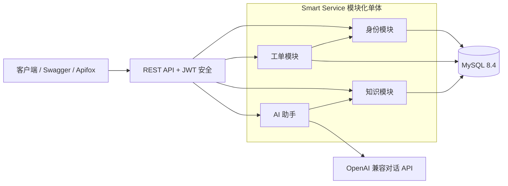

# Smart Service

[English](README.md) | [简体中文](README.zh-CN.md)

[](https://github.com/walnut25/ServiceMind/actions/workflows/ci.yml)
[](https://openjdk.org/projects/jdk/21/)
[](https://spring.io/projects/spring-boot)

Smart Service 是一个 AI 辅助企业服务台平台，在一个模块化 Spring Boot 应用中连接工单流程、
运维知识与有依据的 AI 回答。

项目有意采用模块化单体架构：保持清晰业务边界的同时，降低部署和本地开发复杂度。当前版本是
完整的后端 MVP，包含身份认证、请求人数据隔离、工单指派、审计历史、知识发布，以及与供应商
无关的 RAG 问答能力。

## 工程亮点

| 领域 | 已实现能力 |
| --- | --- |
| 安全流程 | 无状态 JWT 认证、BCrypt 密码、管理员用户管理、RBAC，以及请求人范围内的工单访问 |
| 工单运营 | 优先级、指派、筛选、分页、受控状态流转、评论和不可变审计事件 |
| 知识生命周期 | 草稿、发布、归档、乐观锁、可见性规则和 MySQL 全文搜索 |
| 有依据的 AI | 已发布文章检索、提示词注入边界、可配置的 OpenAI 兼容供应商和来源引用 |
| 可靠性 | Flyway 迁移、RFC 9457 问题响应、健康/指标端点、Docker 健康检查和非 root 容器 |
| 验证体系 | 单元、领域、MockMvc 安全测试，以及由 GitHub Actions 执行的 MySQL 8.4 Testcontainers 测试 |

## 架构



各模块通过应用服务与仓储抽象协作，不共享控制器逻辑。ER 模型、安全流程、工单状态机、RAG
时序和设计取舍见[架构说明](docs/architecture.md)。

## 模块

| 模块 | 职责 | 主要能力 |
| --- | --- | --- |
| `identity` | 身份认证与授权 | 用户管理、BCrypt、JWT 签发、角色、管理员初始化 |
| `ticket` | 支持请求工作流 | 所有权、指派、状态流转、评论、审计轨迹 |
| `knowledge` | 运维知识 | 文章生命周期、可见性规则、分页、全文搜索 |
| `ai` | 有依据的支持回答 | 知识检索、上下文限制、供应商网关、来源引用 |
| `common` | 跨模块 HTTP 能力 | Problem Details、OpenAPI 元数据、稳定分页序列化 |

## 技术栈

- Java 21 与 Spring Boot 3.5
- Spring Web、Validation、Data JPA、Security、OAuth2 Resource Server 和 Actuator
- MySQL 8.4、Flyway 数据库迁移与全文索引
- Springdoc OpenAPI 与 Swagger UI
- JUnit 5、Mockito、MockMvc、AssertJ 和 Testcontainers
- Docker 多阶段构建与 Docker Compose
- GitHub Actions 持续集成

## 本地运行

最快方式只需要 Docker：

```bash
docker compose up --build
```

该命令会构建应用镜像、启动 MySQL、执行 Flyway 迁移，并等待两个服务健康。可将
`.env.example` 复制为 `.env`，自定义端口、凭据或 AI 供应商。仓库内默认值仅供本地开发。

如果 `3306` 已被占用，在 `.env` 中设置其他宿主机端口：

```text
MYSQL_PORT=3307
```

如需在宿主机直接运行应用，请使用 JDK 21：

```bash
docker compose up -d mysql
./mvnw spring-boot:run
```

默认本地管理员为 `admin` / `Admin123!`。任何非本地环境都必须使用高强度的 `JWT_SECRET`、
管理员密码和数据库凭据。

## 五分钟 API 演示

登录并复制响应中的 `accessToken`：

```bash
curl -X POST http://localhost:8081/api/v1/auth/login \
  -H "Content-Type: application/json" \
  -d '{"username":"admin","password":"Admin123!"}'
```

创建坐席账号：

```bash
curl -X POST http://localhost:8081/api/v1/users \
  -H "Content-Type: application/json" \
  -H "Authorization: Bearer <access-token>" \
  -d '{"username":"agent-one","password":"AgentPass123!","roles":["AGENT"]}'
```

创建工单：

```bash
curl -X POST http://localhost:8081/api/v1/tickets \
  -H "Content-Type: application/json" \
  -H "Authorization: Bearer <access-token>" \
  -d '{"title":"VPN unavailable","description":"The whole team cannot connect","priority":"P1"}'
```

指派工单并开始处理：

```bash
curl -X PATCH http://localhost:8081/api/v1/tickets/1/assignee \
  -H "Content-Type: application/json" \
  -H "Authorization: Bearer <access-token>" \
  -d '{"username":"agent-one"}'

curl -X PATCH http://localhost:8081/api/v1/tickets/1/status \
  -H "Content-Type: application/json" \
  -H "Authorization: Bearer <access-token>" \
  -d '{"status":"IN_PROGRESS"}'
```

## API 概览

| 领域 | 接口 | 权限 |
| --- | --- | --- |
| 身份认证 | `POST /api/v1/auth/login` | 公开 |
| 用户 | 创建、查询、列表、启用、禁用 | 管理员 |
| 工单 | 创建、查询、列表/筛选、指派、流转 | 已认证；指派/流转要求坐席或管理员 |
| 评论 | 添加和查询工单评论 | 工单请求人，或坐席/管理员 |
| 审计 | 查询工单审计事件 | 坐席或管理员 |
| 知识 | 创建、更新、发布、归档、列表、搜索 | 读取需认证；写入要求坐席或管理员 |
| AI 助手 | `POST /api/v1/ai/answers` | 已认证 |

应用运行后可访问：

- OpenAPI JSON：[http://localhost:8081/v3/api-docs](http://localhost:8081/v3/api-docs)
- Swagger UI：[http://localhost:8081/swagger-ui.html](http://localhost:8081/swagger-ui.html)
- 健康检查：[http://localhost:8081/actuator/health](http://localhost:8081/actuator/health)

## 测试与 CI

运行快速单元、领域和 API 安全测试：

```bash
./mvnw clean test
```

使用一次性 MySQL 8.4 容器运行完整测试：

```bash
./mvnw verify -Pintegration
```

当前包含 30 项单元/API 测试和 3 项 MySQL 集成测试。针对 `master` 的每次推送与拉取请求，
GitHub Actions 都会执行完整测试并构建应用镜像。

运行可重复的端到端用户旅程（PowerShell）：

```powershell
powershell -ExecutionPolicy Bypass -File .\scripts\smoke-test.ps1 -MysqlPort 3307 -StopAfter
```

测试层级、预期结果、Swagger 手动检查、可选真实 AI 验证和故障排查，见
[完整测试手册](docs/testing.zh-CN.md)。简历描述、60 秒介绍、五分钟演示流程和常见设计问题，见
[求职讲解稿](docs/interview-guide.md)。

## AI 配置

提供凭据前，AI 助手默认关闭。它使用 OpenAI 兼容对话 API，默认供应商为 DeepSeek：

```bash
set AI_CHAT_ENABLED=true
set AI_API_KEY=your-api-key
./mvnw spring-boot:run
```

通过 `AI_BASE_URL` 和 `AI_MODEL` 可切换供应商。API 密钥只保存在环境变量中，绝不能提交到
仓库。如果没有已发布文章匹配问题，API 会返回明确的“无依据”响应，不调用模型。

## 项目结构

```text
src/main/java/dev/smartservice/
├── identity/    # 用户、认证、JWT、角色
├── ticket/      # 工作流、指派、评论、审计事件
├── knowledge/   # 文章生命周期与检索
├── ai/          # RAG 编排与供应商适配器
└── common/      # HTTP 错误、OpenAPI、Web 配置
```

## 后续规划

- 文档分块与向量检索
- 异步知识摄取与答案评测
- 通知和分析模块
- 限流、刷新令牌和生产级密钥管理
