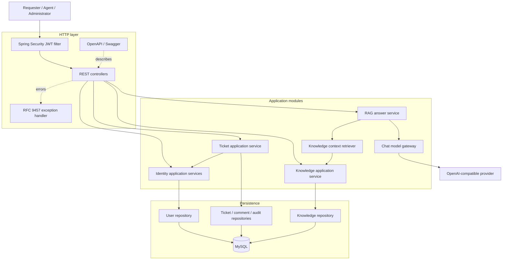
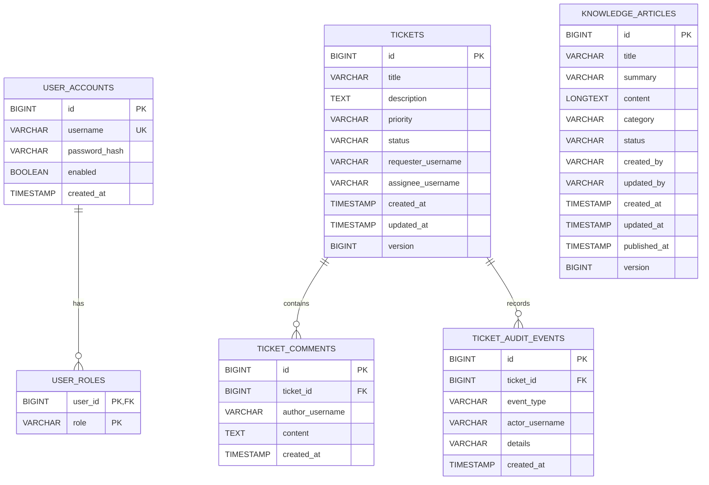
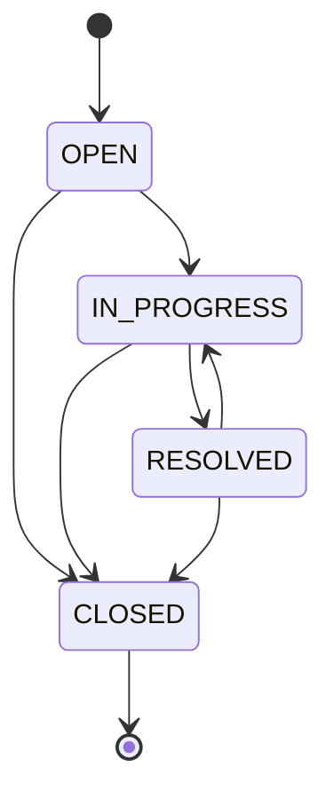
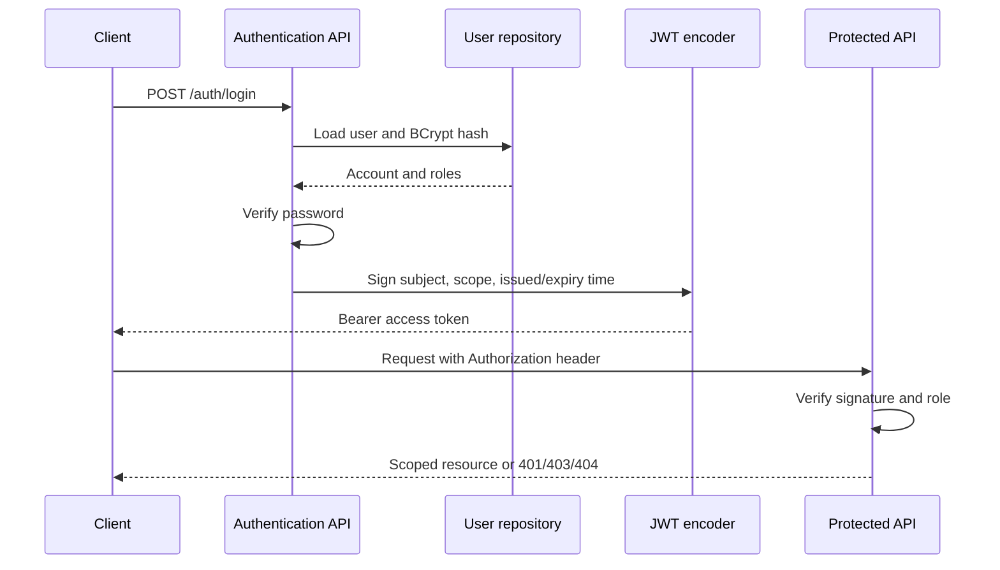
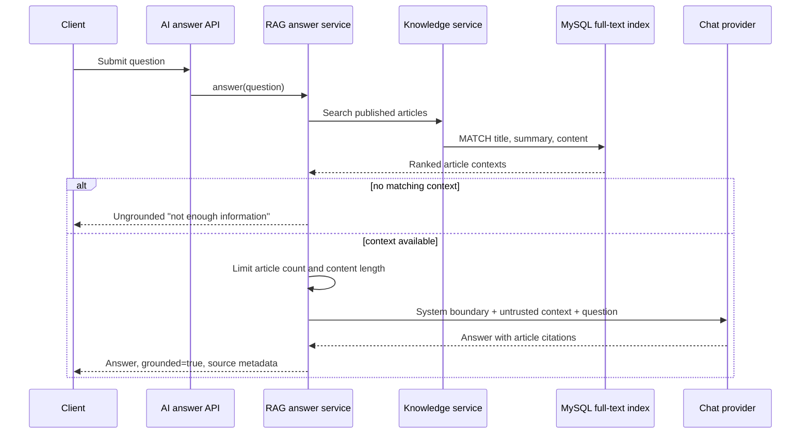

# Smart Service architecture

## Design goals

Smart Service is structured as a modular monolith to keep the first deployment operationally simple
without losing clear business boundaries. Each module owns its API, application services, domain model,
and persistence abstractions.

The current architecture optimizes for:

- explicit ticket, identity, knowledge, and AI boundaries;
- secure multi-role workflows and requester data isolation;
- auditable changes and controlled domain transitions;
- provider-neutral AI integration;
- repeatable local, CI, and container environments.

## Component view

## Module dependencies

| Source module | Dependency | Reason |
| --- | --- | --- |
| `ticket` | `identity` | Validate that an assignee exists, is enabled, and has an agent/admin role |
| `ai` | `knowledge` | Retrieve published support articles as grounded context |
| all HTTP modules | `common` | Consistent Problem Details, page serialization, and OpenAPI configuration |

The identity and knowledge modules do not depend on ticket or AI code, keeping the dependency direction
acyclic.

## Data model

Actor, requester, and assignee usernames are stored as operational snapshots rather than foreign keys.
The application validates assignees through the identity module, while historical audit records remain
readable even if account management changes later.

## Ticket workflow

Transitions are enforced in the domain model. The application service records the authenticated actor,
previous state, and target state in the audit trail inside the same database transaction.

## Authentication and authorization flow

Requester ticket reads and comments are checked again in the ticket application service. Unauthorized
requesters receive `404` for another user's ticket so the API does not disclose whether it exists.

## Grounded answer flow

Knowledge text is explicitly treated as untrusted reference data in the system prompt. The provider
adapter checks configuration and translates upstream failures into `503` or `502` Problem Details.

## Consistency and failure handling

- Ticket mutations and their audit events share a transaction.
- JPA optimistic locking prevents silent lost updates to tickets and articles.
- Flyway validates and applies schema changes before Hibernate validates mappings.
- Validation, missing resources, invalid transitions, AI configuration, and provider failures use
  consistent RFC 9457 responses.
- The application waits for MySQL health in Compose and exposes its own Actuator health endpoint.
- Testcontainers executes migrations and repository queries against the same MySQL major version used
  in local Compose.

## Current trade-offs

- MySQL full-text search keeps the MVP small; vector search is a planned retrieval upgrade.
- Access tokens are stateless and short-lived; refresh-token rotation is not implemented yet.
- Roles are assigned when an account is created; password reset and later role editing are not implemented yet.
- Notification and analytics boundaries are planned but intentionally excluded from the MVP.
